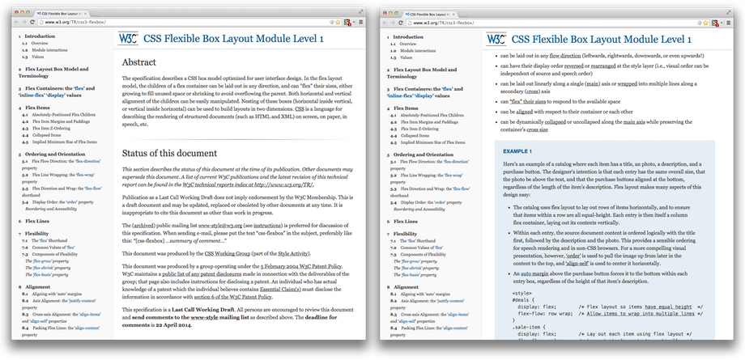
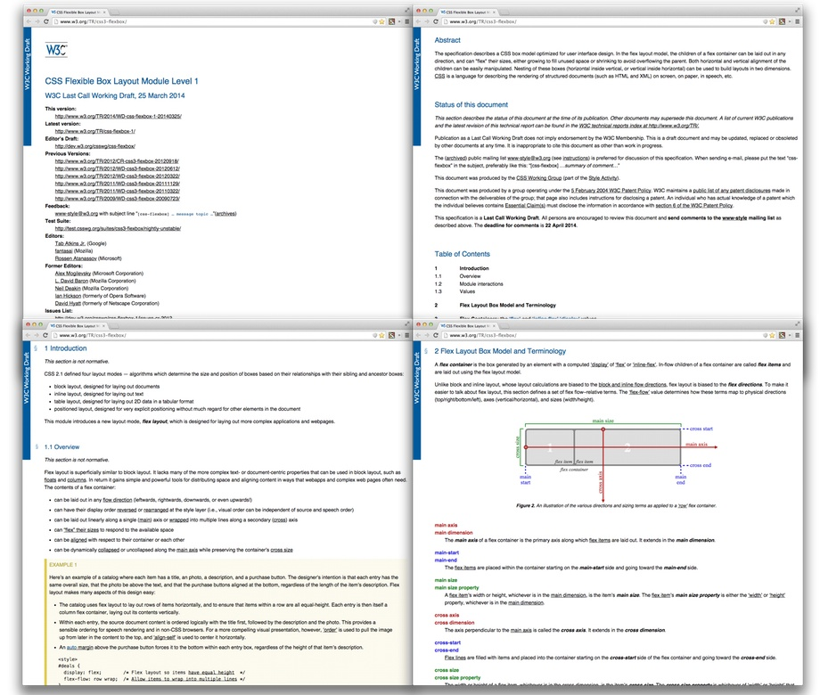
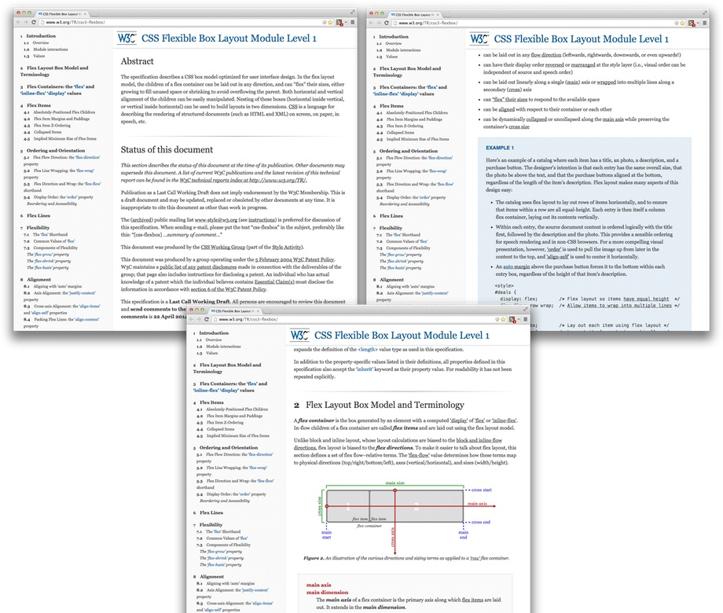

# W3C Specs Beautifier

O W3C Specs Beautifier é um conjunto de estilos em CSS que permite tornar a leitura das especificações do W3C mais agradável. Estes estilos devem ser utilizadas junto com extensão Stylish que permite configurá-los de acordo com o sites de seu interesse.

## Motivação

Leitura não web é uma tarefa cansativa, ainda mais quando se trata de documentos técnicos. Alguns sites levam isto muito a sério como [Medium](https://medium.com), [A List Apart](http://alistapart.com) e [Pocket](http://getpocket.com) e a experiência de leitura torna-se bastante agradável. Por este motivo, decidi personalizar os estilos de algumas especificações do W3C (que andei consultando ultimamente) para melhorar sua experiência de leitura!

## Instalação

O processo de instalação é bastante simples e consiste em permitir que o seu navegador renderize os estilos personalizados para os sites de seu interesse. Veja como é fácil instalar:

1. Instale o complemento Stylish para o seu navegador predileto.
2. Abra o complemento e selecione 'Manage installed styles'.
3. Clique no botão 'Write new style'.
4. Adicione um nome, copie os estilos e adicione os sites que terão os estilos aplicados como no exemplo abaixo.
    * **Name:** W3C Specs
    * **Code:** `<colar o código do estilo>`
    * **Applies to:** *&lt;URLs starting with&gt;* `http://www.w3.org/TR/css3-flexbox`
5. Acesse a página com o estilo aplicado e deleite-se com a sua leitura! ;)

## Melhorias Realizadas

* Remoção de alguns ruídos
* Destaque e fixação do título no topo
* Fixação do índice na lateral sem visível permitindo uma consulta e navegação direta e objetiva
* Utilização de fontes com serifa, maiores e em um tom mais suave
* Adição de espaços negativos
* Adição de linhas separadoras para delimitar capítulos
* Melhorias em caixas de exemplos, citações e outros

## Antes e Depois

Imagens de algumas páginas da especificação de CSS Flexbox Layout antes da utilização **W3C Specs Beautifier**.

Imagens de algumas páginas da especificação de CSS Flexbox Layout depois da utilização **W3C Specs Beautifier**.

## Lista de Especificações

Apenas algumas especificações foram utilizadas:

* [CSS Flexbox Layout](http://www.w3.org/TR/css3-flexbox/) 
* [CSS Media Queries](http://www.w3.org/TR/css3-mediaqueries/)

## Problemas Conhecidos

* Não foi testado para dispositivos móveis e desconhece-se a existência deste complementos para navegadores móveis.
* Os estilos possuem uma organização mínima.
* As especificações testadas do W3C não possui um padrão de marcação bem definido. Isso dificulta a criação dos estilos, promovem a utilização de *hacks* e mina qualquer iniciativa de organização mais apurada. 
* Este projeto está em constante modificação e pode conter inconsistências.
* Não foi realizado testes em todos os navegadores e, no caso de outros problemas, por favor contribua com projeto! ;)